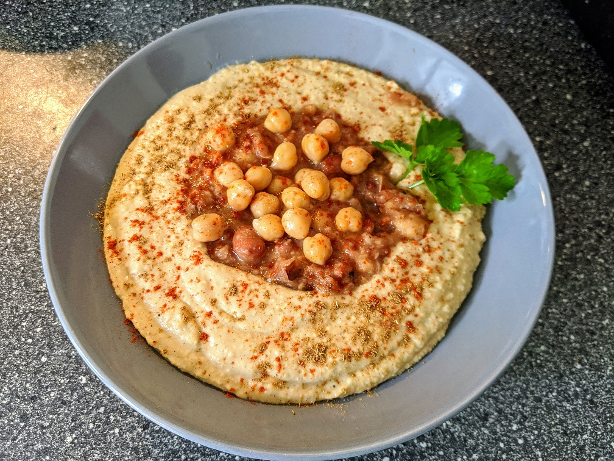
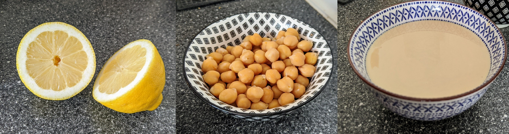
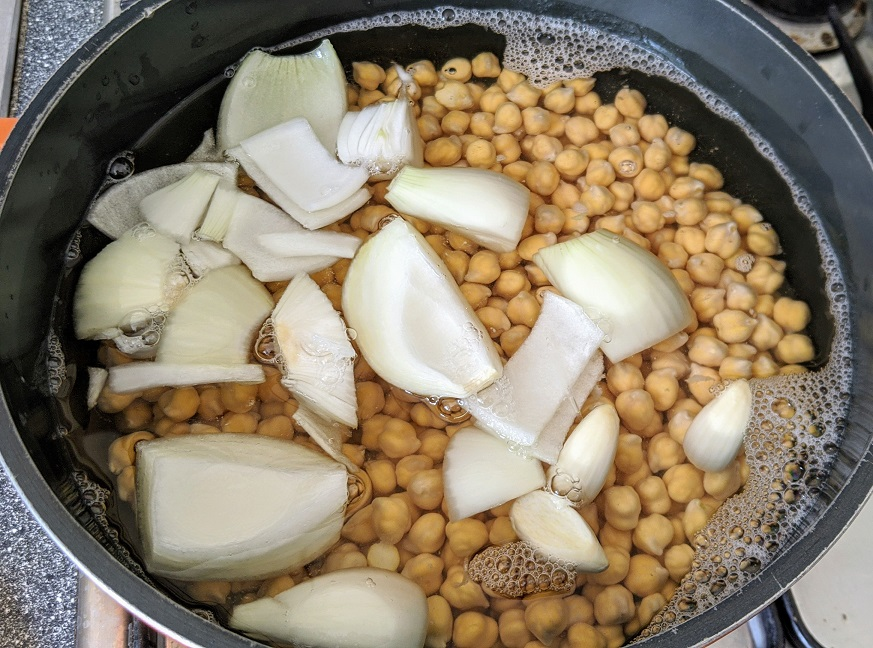
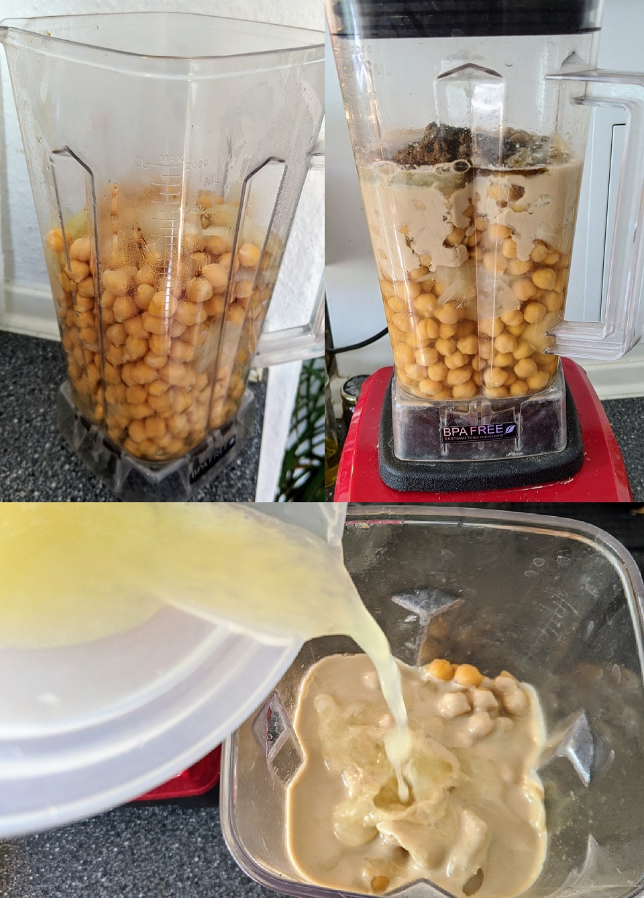
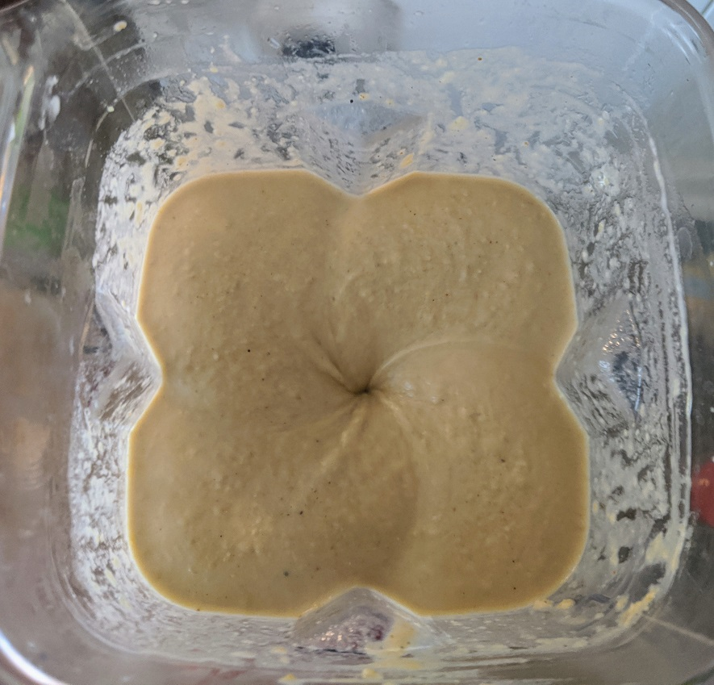
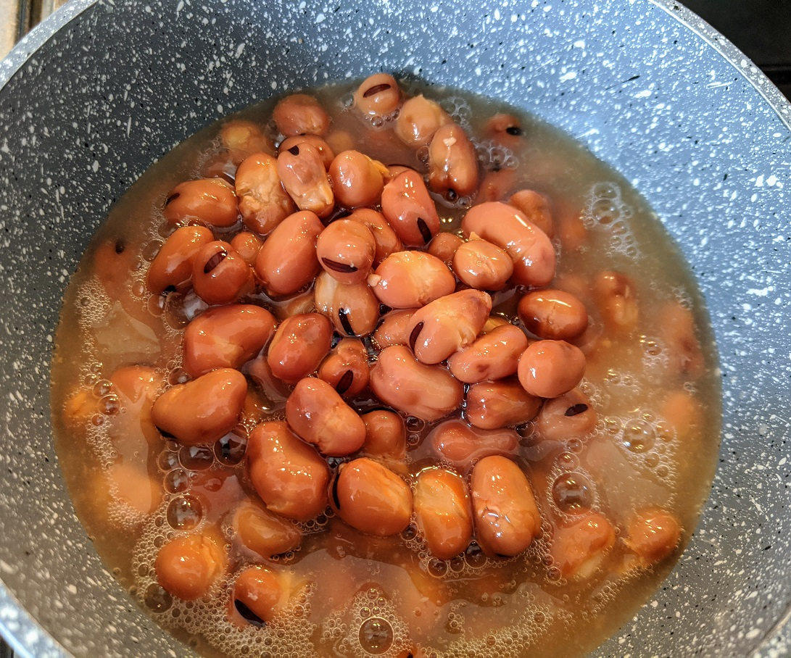
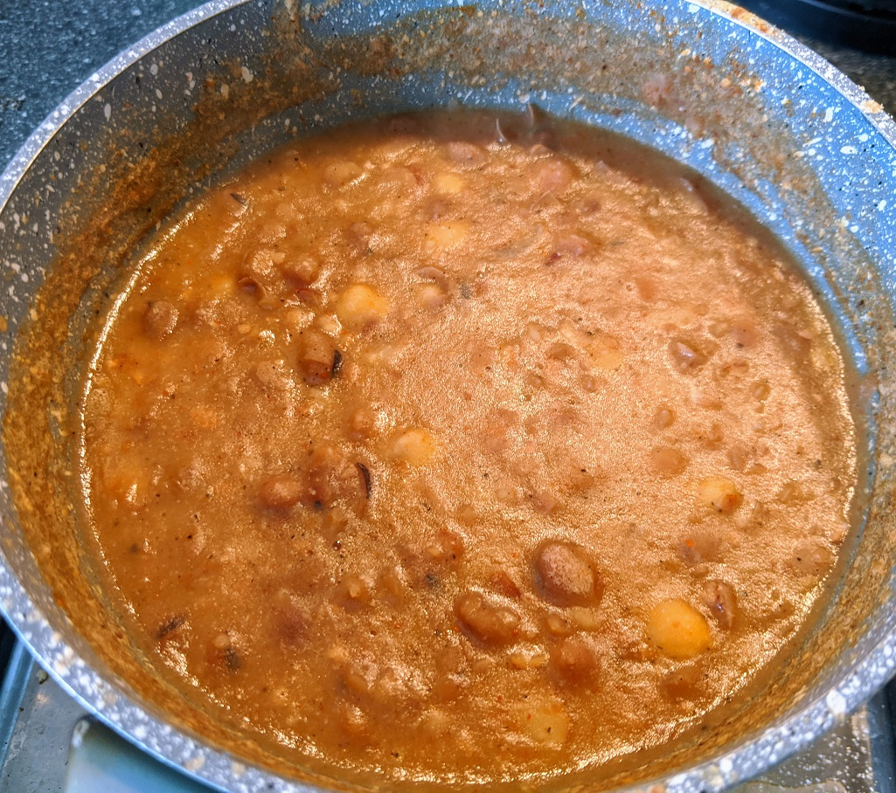
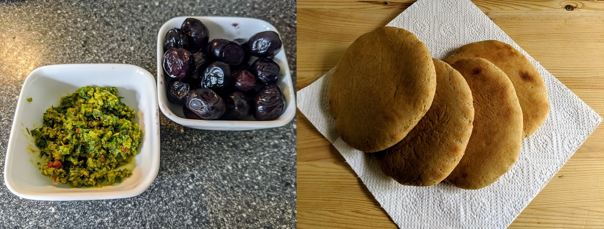

As a person who grew up in the center of Israel in a city between Jaffa and Ramla, I spent a lot of time in Hummus restaurants with family and friends. \
Hummus stimulates serotonin in the brain and fills us with a pleasant and happy feeling. \
The Israeli cuisine, which is composed of Jewish kitchens from all over the world, lovingly embraced the finest Israeli-Arab's hummus. \
It didn't take too long for me to realize that I must know how to make delicious hummus at home. \
Over the years in any opportunity I collected tips for improving the recipe, and finally I came up with a simple and perfect recipe. \
I am happy to share the recipe with you because to me hummus is joy, hummus is love and harmony. \
Hummus is Vegan!

# **Ingredients:**

**5 servings**\
Nutritional values per serving:\
**Cal**: 508 | **Protein**: 27 | **Carbs**: 32 | **Fat**: 17

* 500 gr. (2 cups) of dry chickpeas
* 1 big onion
* 3 garlic cloves
* 1 big fresh lemon juice
* 1 tsp of Cumin
* 1 tbs of Himalaya salt
* 1 tsp of black pepper
* 1 tsp of Baking soda powder
* 125 ml. (½ cup) raw Tahini

## For The Toppings:

**5 servings**\
Nutritional values per serving:\
**Cal**: 60 | **Protein**: 4.2 | **Carbs**: 10 | **Fat**: 5

* 1 can (300 gr.) of Fava beans
* ½ tbs Red Chili flakes
* 1 Garlic clove
* Extra virgin Olive oil
* Fresh parsley  
* ½ fresh lemon juice

## Lets start -

First, mix the Baking soda powder in a cup of water and stir to dissolve.\
Then pour the chickpeas into a large bowl, add the water with the Baking soda powder and add more fresh water to cover the chickpeas, let them soak overnight for a minimum of 12 hours.

Drain and rinse the chickpeas, place it in a pot and cover with fresh water. \
Cut the onion to big portions and add it with the garlic cloves to the pot. \
Place the pot on the stove and let it boil with lead half covered. \
When it boils, lower the stove to its low heat and continue the cook for 1½ hours with lead fully covered.  \
When its done, check if the chickpeas are ready, it should be very soft.

Use a strainer to filter the contents of the pot and keep the cooking stock  in a separate bowl, we will use it soon.\
Now let’s place our filtered ingredients in a strong food processor, but keep ½ cup of the chickpeas separate for topping later.

add the salt, cumin, black pepper and tahini to it. Add the lemon juice too. \
Now we will use the stock we kept before, we will start adding 1/2 cup to it and turn the food processor on. The blend should get creamy, smooth, but not too liquid. continue to add small amounts of the stock water to get your desired mash results. 

For the toppings you can use many variations such as mushrooms, eggplants etc. \
In this recipe we will use cooked Fava beans, but you can choose whatever you like to finalize this super tasty Hummus plate.

Empty the cooked fava beans can in a small sauce pan and let it boil. At the boiling time add ¼ cup of the stock water, ½ fresh lemon juice, 1 mashed garlic clove and the chili flakes. Lower the stove heat and stir. \
Cook it for another 5 minutes.

Now pour 5-7 tbsp of the Hummus mash to a round deep plate, spread it and make a hole in the center. \
Pour the fava beans to this hole and finish with some cooked chickpeas on top and 3 fresh parsley leaves.  	\
Sprinkle olive oil on top of everything, as much as you like, we use 2 tbsp.\
You can decorate with a bit of paprika or cumin powder on top to make it look even better 😊

As a siders we add some black olives and green chili paste, and of course a pita bread to wipe the delicious Hummus.

Enjoy!