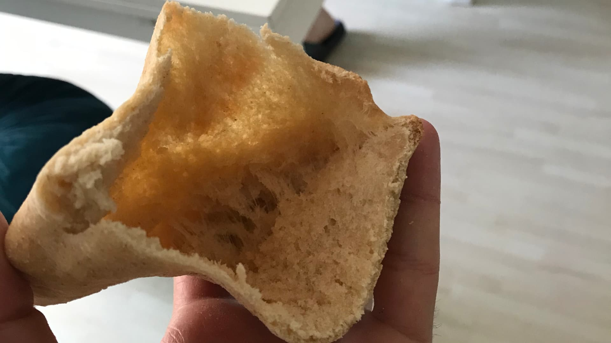

## What is pita bread?

**A pita bread is a round bread, normally baked from wheat flour and normally has an interior pocket.**
Because of the pocket shape, it can be (and most commonly) used for a sandwich, you crack it open, stuff whatever you feel like inside, and you've got a neat, portable, and easy to eat, sandwich.
Check out <Link to="/recipes/home-made-falafel">our home made falafel</Link> for the ultimate choice for filling to a pita bread sandwich.
The sandwich, the most common use of this bread is not the only option though, many pita lovers also love to use it in a less constructed way, they just tear off a piece of it and dip it in a dip like <Link to="/recipes/the-ultimate-hummus-protein-bomb">hummus</Link> or a sauce like <Link to="/recipes/green-chili-sauce">our green chili sauce</Link> or even a soup.
It doesn't matter how you use it, there are no rules, the fresh pita bread is simple, tasty, and a bread option which is normally without a doubt VEGAN.

## Is making pita bread at home worth the effort?

**Yes it does,** the result will be fresh and super tasty, so much better then what you can usually buy in a normal grocery store. I know there are different kinds of store-bought pita bread, some are better than others, its definitely worth the time to find a good place to buy them, but all of them will share the same flaw, the lack of freshness. Unfresh pita bread will never be as good as a fresh homemade one, there is something with the taste, the smell, the fluffiness of fresh homemade bread, that you will never get when buying it in the store. Using this step-by-step guide to making vegan homemade pita bread from scratch will make sure you will have a good result and the process is fun and easy.

## Is flatbread the same as pita bread?

No, the flatbread is a family of unleavened bread, that usually made without yeast and contains flour, water, and salt.
The pita bread can be considered as part of the flatbread family although it is made with yeast and it has a pocket (not really flat). The flatbread family includes tortilla, naan, lavash, chapati, focaccia, and many more - while researching flatbread I came across <Link to="https://www.tasteatlas.com/100-most-popular-flatbreads-in-the-world">this article with 100 different kinds of most popular flat breads</Link>.

## So what makes pita different from other types of flatbread?

Well, the **pocket**.
When the pita bread is baked it puffs up, after the baking process is done the pita is left with two layers, separate from each other which forms the pocket.  

## How to make the pita bread to puff up and forms the pocket?

There are two key points in the process of making pita bread that leads to the desired pocket outcome:

- **Heat the oven to high temperature (250℃):** the heat of the oven cooks the outside of the dough, up and down. While the outside part is baking, moisture in the inner part starts to evaporate and the steam causes the dough to puff up and form the pocket.
- **Avoid flattening the dough too much:** if you flat the dough too thin it might not puff and no pocket will form, or it might cause the layers to be too thin and the pita won't be stable enough to stuff things in it. It is a good idea to flat just one for the first time and bake it, that way you can test the result.
